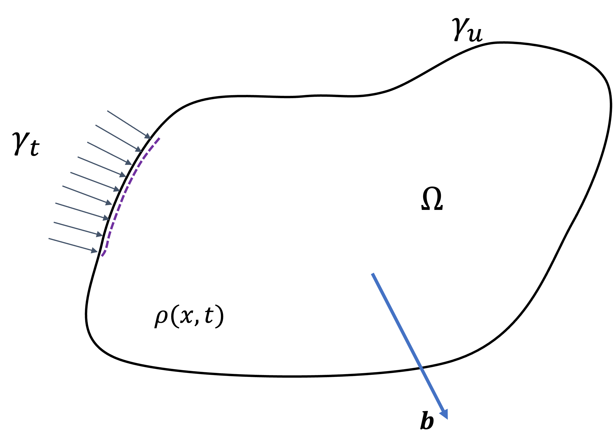

Governing equations of continuum mechanics
==========================================

The fundamental equations that underpin the Material Point Method (MPM) consist of the conservation of mass and momentum equations. Currently, we are not addressing non-isothermal problems, so the energy equation is omitted for now. However, we plan to extend ExaGOOP to incorporate non-isothermal scenarios and temperature-dependent constitutive models in the near future. Additionally, we are not considering material elements with internal torques, which means that the angular momentum conservation equation is not included. In the context of MPM, the laws of mass and momentum conservation are expressed within a Lagrangian framework.

The Lagrangian description of the motion of a particle is expressed in terms of its material coordinates :math:`X` and time :math:`t`. Material coordinates refer to a coordinate system attached to the particle under consideration in its initial configuration (time :math:`t=0`). In the Lagrangian description, the particle is assumed to move with the local velocity of the medium, and other continuum properties are studied in this coordinate system.

Hence, the motion of a particle is expressed in the Lagrangian description as,

.. math::
	
	\begin{aligned}
	\mathbf{x} = \mathbf{x}(\mathbf{X},t)
	\end{aligned}

It is to be noted that by definition, the above particle had the coordinates defined by :math:`\mathbf{X}` at time :math:`t=0`. The displacement :math:`\mathbf{u}` of the particle with respect to the initial configuration is then expressed as,

.. math::
	
	\begin{aligned}
	\mathbf{u} = \mathbf{x}(\mathbf{X},t)-\mathbf{X}
	\end{aligned}

The definition of the velocity of the particle :math:`\mathbf{v}` then follows as,

.. math::
	
	\begin{aligned}
	\mathbf{v}  &= \dot{\mathbf{x}} =  \frac{d \mathbf{u}(\mathbf{X},t)}{dt}\\
	&= \frac{\partial \mathbf{u}(\mathbf{X},t)}{\partial t}
	\end{aligned}

Similarly, the time rate of change of any property of the particle expressed in the Lagrangian framework is its partial time derivative, and math:`\mathbf{X}` simply serves as a parameter. Similar to the expression of velocity given above, the acceleration of the particle can also be expressed as,

.. math::
	
	\begin{aligned}
	\mathbf{a}  &= \dot{\mathbf{v}} =  \frac{\partial \mathbf{v}(\mathbf{X},t)}{\partial t}\\
	&= \frac{\partial^2 \mathbf{u}(\mathbf{X},t)}{\partial t^2}
	\end{aligned}

Without going deep into the details, some of the mathematical terms used in the governing equations are defined in the following paragraphs.

Deformation gradient tensor
---------------------------

The deformation gradient tensor :math:`\mathbf{F}` is defined as,

.. math::
	
	\begin{aligned}
	\mathbf{F}  = \frac{\partial \mathbf{x}(\mathbf{X},t)}{\partial \mathbf{X}}
	\end{aligned}

and is a symmetric, second-order tensor which describes the stretch and rotation of a material element. Mathematically, it is a linear operator that maps the current configuration of a continuum body to its initial configuration.

Velocity gradient tensor
------------------------

The velocity gradient tensor :math:`\mathbf{L}` is defined as the spatial gradient of velocity.

.. math::
	
	\begin{aligned}
	\mathbf{L} = \frac{\partial \mathbf{v}}{\partial x}
	\end{aligned}

This second-order tensor can be decomposed into a symmetric part (rate of deformation tensor) and an anti-symmetric part (spin tensor) as shown below.

.. math::
	
	\begin{aligned}
	\mathbf{L} = \mathbf{D}+{\Omega}
	\end{aligned}

where,

.. math::
	
	\begin{aligned}
	\mathbf{D} &= \frac{1}{2} (\mathbf{L}+\mathbf{L}^T)\\
	\Omega &= \frac{1}{2} (\mathbf{L}-\mathbf{L}^T)\\
	\end{aligned}

The rate of deformation tensor :math:`D` indicates the rate of strain suffered by a material element and is used to find the stresses through a constitutive model. The spin tensor :math:`\Omega` refers to the rotation the material element undergoes. The velocity gradient tensor is related to the deformation gradient tensor through the following expression,

.. math::
	
	\begin{aligned}
	\mathbf{L} = \dot{\mathbf{F}}\mathbf{F}^{-1}
	\end{aligned}

Jacobian
--------

The jacobian (:math:`\mathbf{J}`) is defined as the determinant of the deformation gradient tensor (:math:`\mathbf{F}`).

.. math::
	
	\begin{aligned}
	J=\left|\frac{\partial \mathbf{x}}{\partial \mathbf{X}}\right| = \left| \mathbf{F} \right|
	\end{aligned}

A necessary and sufficient condition for the motion to be invertible is to have a non-zero Jacobian at all times. The Jacobian also relates the volume of an infinitesimal body at time :math:`t` to its volume at the initial time through the relation

.. math::
	
	\begin{aligned}
	\mathrm{d} V=\left|\begin{array}{ccc}\mathrm{d} x_1 & \mathrm{~d} x_2 & \mathrm{~d} x_3 \\ \delta x_1 & \delta x_2 & \delta x_3 \\ \Delta x_1 & \Delta x_2 & \Delta x_3\end{array}\right|=J \mathrm{~d} V_0
	\end{aligned}

where :math:`\mathrm{d} V` and :math:`\mathrm{d} V_0` are the volumes at current and initial time.

Stress tensor and Constitutive models
-------------------------------------

The stress tensor :math:`\mathbf{\sigma}` is a symmetric, second-order tensor that defines the state of stress at a point. The traction or force per unit area acting at the point on an imaginary surface with normal :math:`\mathbf{n}` is related to the stress tensor at the point as,

.. math::
	
	\begin{aligned}
	\mathbf{t} = \mathbf{n}.\mathbf{\sigma}
	\end{aligned}

Stress tensor at a point is related to the rate of deformation tensor :math:`\mathbf{D}` through a constitutive relation. Depending on the material considered, a multitude of constitutive relations, such as linear elastic, plastic, and Newtonian fluids, exist.

Equation of conservation of mass
--------------------------------

For a continuum body occupying a region :math:`\Omega` in space and bounded by a surface :math:`\Gamma=\Gamma_u \cup \Gamma_t` as shown in :numref:`compdom`, the total mass :math:`m` of the body is given by,

	: Computational domain, boundary and various forces acting on it

.. math::
	
	\begin{aligned}
	m=\int_{\Omega} \rho(\mathbf{x}, t) d V
	\end{aligned}

where :math:`\rho` is the density of the material.

Since the mass contained in the region :math:`\Omega` and moving with local material velocity is constant, the total time derivative of the total mass  is zero. Hence,

.. math::
	
	\begin{aligned}
	\frac{\mathrm{D}}{\mathrm{D} t} \int_{\Omega} \rho(\mathbf{x}, t) \mathrm{d} V=\int_{\Omega}(\dot{\rho}+\rho \nabla \cdot \boldsymbol{v}) \mathrm{d} V=0
	\end{aligned}

which leads to the mass conservation equation as,

.. math::
	
	\begin{aligned}
	\rho J-\rho_0=0
	\end{aligned}

Conservation of momentum
------------------------

Newton’s second law of motion states that the rate of change of momentum of a body is equal to the sum of the volume and surface forces acting on it. Consider the same body as shown in :numref:`compdom`, with a body force per unit mass :math:`\mathbf{b}` and traction :math:`\mathbf{t}` acting on it’s
surface. The law of conservation of momentum is expressed as,

.. math::
	
	\begin{aligned}
	\frac{\mathrm{D}}{\mathrm{D} t} \int_{\Omega} \rho \mathbf{v} \mathrm{d} V=\int_{\Omega} \rho \mathbf{b}(\mathbf{x},t) \mathrm{d} V + \int_{\Gamma_t} \mathbf{t}(\mathbf{x},t).\mathbf{n} \mathrm{d} A	
	\end{aligned}

By invoking the Reynolds transport theorem and upon simplifying, one obtains,

.. math::
	
	\begin{aligned}
	\rho \dot{\mathbf{v}} = \rho \mathbf{b} + \nabla . \sigma
	\end{aligned}

Initial and Boundary conditions
-------------------------------

Two types of boundary conditions are commonly considered, namely boundaries with specified velocity and specified traction, respectively.

.. math::
	
	\begin{aligned}
	& \left\{\begin{array}{l}
	\left.(\boldsymbol{n} \cdot \boldsymbol{\sigma})\right|_{\Gamma_t}=\overline{\boldsymbol{t}} \\
	\left.\boldsymbol{v}\right|_{\Gamma_u}=\overline{\boldsymbol{v}}
	\end{array}\right. \\
	\end{aligned}

Initial conditions involve specifying the displacement of material points and velocities at time t=0.

.. math::
	
	\begin{aligned}
	& \mathbf{v}(\mathbf{x}, 0)=\mathbf{v}_0(\mathbf{x}), \quad \mathbf{u}(\mathbf{x}, 0)=\mathbf{u}_0(\mathbf{x})
	\end{aligned}
